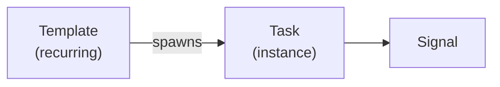

# Core Data Model

## Overview

Tender's data model centers on three entities:

- **Template** — Defines recurring tasks (maintenance, habits)
- **Task** — A single actionable item (one-off or spawned from a template)
- **Signal** — Emotional and behavioral data attached to tasks



## Design Decisions

### IDs

All primary keys are **UUIDv7** (time-ordered UUIDs) for natural sorting and index efficiency. Generated via [sqlean/uuid](https://github.com/nalgeon/sqlean/blob/0.24.1/docs/uuid.md).

### JSON Columns

SQLite/libsql lacks native array and complex types. We use `TEXT` columns with JSON content, validated in application code:

- `tags` — JSON array of strings
- `recurrence` — Discriminated union (see below)
- `payload` — Flexible signal data

Queries use the [JSON1 extension](https://www.sqlite.org/json1.html).

### Timestamps

All timestamps stored as ISO 8601 strings in UTC.

---

## Schema

### templates

Defines recurring task patterns.

```sql
CREATE TABLE templates (
  id TEXT PRIMARY KEY,  -- UUIDv7
  description TEXT NOT NULL,
  recurrence TEXT,  -- JSON: Recurrence | null
  prep_notes TEXT,
  tags TEXT DEFAULT '[]',  -- JSON array
  created_at TEXT NOT NULL,  -- ISO 8601 UTC
  archived_at TEXT  -- ISO 8601 UTC, null if active
);

CREATE INDEX templates_archived_at ON templates(archived_at);
```

### tasks

Individual task instances.

```sql
CREATE TABLE tasks (
  id TEXT PRIMARY KEY,  -- UUIDv7
  template_id TEXT REFERENCES templates(id),  -- null for one-off tasks
  description TEXT NOT NULL,
  tags TEXT DEFAULT '[]',  -- JSON array
  prep_notes TEXT,
  due_at TEXT,  -- ISO 8601 UTC
  created_at TEXT NOT NULL,  -- ISO 8601 UTC
  started_at TEXT,  -- ISO 8601 UTC, for passive time tracking
  completed_at TEXT,  -- ISO 8601 UTC
  deleted_at TEXT,  -- ISO 8601 UTC, soft delete
  duration_override INTEGER,  -- minutes, user correction to passive tracking
  blocked_by_task_id TEXT REFERENCES tasks(id),  -- optional blocker task
  blocked_reason TEXT  -- optional freeform blocker description
);

CREATE INDEX tasks_template_id ON tasks(template_id);
CREATE INDEX tasks_due_at ON tasks(due_at);
CREATE INDEX tasks_completed_at ON tasks(completed_at);
CREATE INDEX tasks_deleted_at ON tasks(deleted_at);
CREATE INDEX tasks_blocked_by ON tasks(blocked_by_task_id);
```

#### Soft Delete

Tasks use soft delete via `deleted_at`. A task with `deleted_at IS NOT NULL` is considered deleted and should be excluded from normal queries. This preserves history and allows undo.

#### Blockers

Tasks can be blocked in two ways (both optional, can coexist):

- **`blocked_by_task_id`** — FK to another task that must be completed first
- **`blocked_reason`** — Freeform text describing what's blocking (e.g., "waiting for Sarah's address")

The agent can discover blockers through conversation and offer to create a blocking task, linking it via `blocked_by_task_id`.

### signals

Emotional and behavioral data points.

```sql
CREATE TABLE signals (
  id TEXT PRIMARY KEY,  -- UUIDv7
  task_id TEXT NOT NULL REFERENCES tasks(id),
  timestamp TEXT NOT NULL,  -- ISO 8601 UTC
  kind TEXT NOT NULL,  -- SignalKind enum
  payload TEXT DEFAULT '{}'  -- JSON
);

CREATE INDEX signals_task_id ON signals(task_id);
CREATE INDEX signals_kind ON signals(kind);
```

---

## Types

### Recurrence

A discriminated union representing how a template recurs.

```typescript
type Recurrence =
	| { type: 'interval'; duration: string } // ISO 8601 duration
	| { type: 'rrule'; rule: string } // RFC 5545 RRULE
```

#### Interval (relative to last completion)

Used when the gap between occurrences matters, not the calendar date.

```json
{ "type": "interval", "duration": "P4W" }
```

Examples:

- `P1D` — every day (1 day after completion)
- `P2W` — every 2 weeks
- `P3M` — every 3 months
- `P1Y` — every year

**Next due calculation:** `last_completed_at + duration`

#### RRULE (calendar-anchored)

Used for tasks anchored to calendar dates, following [RFC 5545](https://datatracker.ietf.org/doc/html/rfc5545#section-3.3.10).

```json
{ "type": "rrule", "rule": "FREQ=WEEKLY;BYDAY=SU" }
```

Examples:

- `FREQ=WEEKLY;BYDAY=SU` — every Sunday
- `FREQ=MONTHLY;BYMONTHDAY=1` — 1st of every month
- `FREQ=YEARLY;BYMONTH=3;BYMONTHDAY=1` — every March 1st
- `FREQ=YEARLY;BYMONTH=1,4,6,9;BYMONTHDAY=15` — quarterly (Jan/Apr/Jun/Sep 15th)

**Next due calculation:** Next occurrence per RRULE from current date.

### SignalKind

```typescript
type SignalKind =
	| 'deferred' // User postponed the task
	| 'feeling' // Emotional check-in
	| 'completed' // Task completion metadata
	| 'inquiry' // Response to "what's blocking you?"
	| 'surfaced' // Task was shown to user
```

### Signal Payloads

Each signal kind has a specific payload shape:

```typescript
type SignalPayload =
	| { kind: 'deferred'; reason?: string }
	| { kind: 'feeling'; moment: 'before' | 'after'; value: string }
	| { kind: 'completed' /* no extra fields, duration in task */ }
	| { kind: 'inquiry'; question: string; response: string }
	| { kind: 'surfaced'; acted_on: boolean }
```

Examples:

```json
// Deferred with reason
{ "kind": "deferred", "reason": "too big" }

// Feeling before starting
{ "kind": "feeling", "moment": "before", "value": "anxious" }

// Task was surfaced but user didn't act on it
{ "kind": "surfaced", "acted_on": false }

// User responded to inquiry about lingering task
{ "kind": "inquiry", "question": "What's making this hard?", "response": "I don't have Sarah's address" }
```

---

## Key Operations

### Spawning a Task from a Template

When a recurring task is completed, spawn the next instance:

```typescript
async function spawnNextInstance(
	template: Template,
	lastCompleted: Date
): Promise<Task> {
	const nextDue = computeNextDue(template.recurrence, lastCompleted)

	return db.insert('tasks', {
		id: uuidv7(),
		template_id: template.id,
		description: template.description,
		tags: template.tags,
		prep_notes: template.prep_notes,
		due_at: nextDue.toISOString(),
		created_at: new Date().toISOString(),
	})
}

function computeNextDue(recurrence: Recurrence, lastCompleted: Date): Date {
	switch (recurrence.type) {
		case 'interval':
			return addDuration(lastCompleted, recurrence.duration)
		case 'rrule':
			return nextOccurrence(recurrence.rule, new Date())
	}
}
```

### Computing Task Duration

```typescript
function getTaskDuration(task: Task): number | null {
	if (task.duration_override != null) {
		return task.duration_override
	}
	if (task.started_at && task.completed_at) {
		const start = new Date(task.started_at)
		const end = new Date(task.completed_at)
		return Math.round((end.getTime() - start.getTime()) / 60000)
	}
	return null
}
```

### Querying by Tag

```sql
-- Find all active tasks tagged "kitchen"
SELECT * FROM tasks
WHERE EXISTS (
  SELECT 1 FROM json_each(tags) WHERE value = 'kitchen'
)
AND completed_at IS NULL
AND deleted_at IS NULL;
```

### Querying Blocked Tasks

```sql
-- Find tasks that are blocked
SELECT t.*, blocker.description AS blocker_description
FROM tasks t
LEFT JOIN tasks blocker ON t.blocked_by_task_id = blocker.id
WHERE t.deleted_at IS NULL
  AND t.completed_at IS NULL
  AND (t.blocked_by_task_id IS NOT NULL OR t.blocked_reason IS NOT NULL);
```

### Template Completion History

```sql
-- All completions of a recurring task
SELECT
  t.id,
  t.completed_at,
  COALESCE(
    t.duration_override,
    CAST((julianday(t.completed_at) - julianday(t.started_at)) * 24 * 60 AS INTEGER)
  ) as duration_minutes
FROM tasks t
WHERE t.template_id = :template_id
  AND t.completed_at IS NOT NULL
  AND t.deleted_at IS NULL
ORDER BY t.completed_at DESC;
```

---

## Future Considerations

### Focus Areas

Not yet modeled. May be:

- A separate table with task associations
- Ephemeral (inferred from conversation context)
- Persistent (user-defined groupings)

### User/Multi-tenancy

Current schema is single-user. Multi-user would add:

- `user_id` to templates, tasks, signals
- Row-level access control

### Learned Patterns

The inference engine will derive patterns from signals:

- Task types (maintenance, goal-driven, emotionally vulnerable)
- Productive procrastination detection
- Optimal surfacing times

These may be stored as computed/cached data or remain in-memory.
