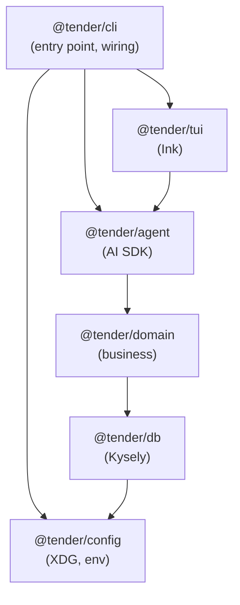
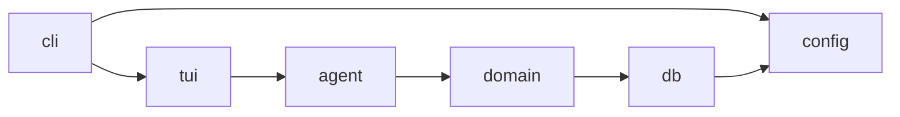
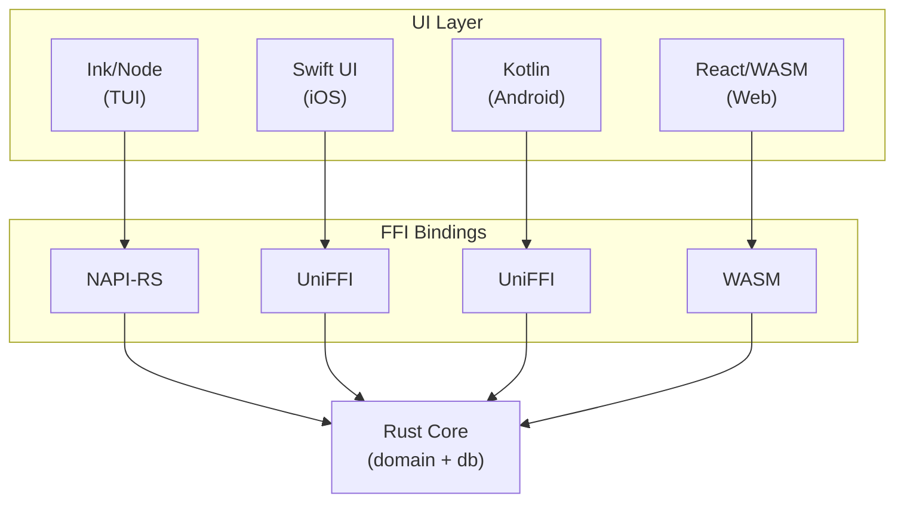

# Technical Architecture

## Overview

Tender is a TypeScript monorepo with a local-first SQLite database and terminal UI. The architecture prioritizes clear module boundaries, type safety, and a path to future cloud sync.



---

## Stack

| Layer           | Technology                | Rationale                                                                                                   |
| --------------- | ------------------------- | ----------------------------------------------------------------------------------------------------------- |
| Runtime         | Node.js                   | Ecosystem compatibility, libsql support                                                                     |
| Package manager | pnpm                      | Fast, efficient, good monorepo support                                                                      |
| Language        | TypeScript (strict)       | Type safety, IDE support                                                                                    |
| Database        | libsql via @libsql/client | Local SQLite now, Turso cloud sync later                                                                    |
| Query builder   | Kysely                    | Type-safe queries, no codegen, good libsql support                                                          |
| TUI             | Ink                       | React component model for terminal UIs                                                                      |
| State/data      | TanStack Query            | Async state management, caching, refetching                                                                 |
| Date/time       | temporal-polyfill         | Modern API, ISO 8601 duration support (will remove when Temporal ships natively)                            |
| Recurrence      | rrule                     | RFC 5545 RRULE parsing                                                                                      |
| Agent           | Vercel AI SDK             | Provider-agnostic, TypeScript-native, tool support (see [Agent Architecture](./0003-agent-architecture.md)) |
| Testing         | Vitest                    | Fast, good ESM support, workspace mode for monorepo                                                         |
| Linting         | oxlint                    | Fast, minimal config                                                                                        |
| Formatting      | Prettier                  | Consistent code style                                                                                       |
| Logging         | debug                     | Namespaced debug output, standard in Node ecosystem                                                         |

---

## Monorepo Structure

```
tender/
├── packages/
│   ├── config/       # @tender/config
│   ├── db/           # @tender/db
│   ├── domain/       # @tender/domain
│   ├── agent/        # @tender/agent
│   ├── tui/          # @tender/tui
│   └── cli/          # @tender/cli
├── docs/
├── pnpm-workspace.yaml
├── package.json
├── tsconfig.json
└── vitest.workspace.ts
```

### Package Responsibilities

#### @tender/db

Database layer. Owns schema, migrations, and data access.

- Kysely database instance and type definitions
- libsql connection management
- SQL migrations
- Repository functions for CRUD operations

```typescript
// Public API examples
export { createDatabase, runMigrations } from "./database";
export { templates, tasks, signals } from "./repositories";
export type { Database } from "./schema";
```

#### @tender/config

Configuration and environment management.

- XDG path resolution (data, config, cache)
- Config file parsing and validation
- Environment variable handling
- Debug/logging configuration

```typescript
// Public API examples
export { getConfig, getDataPath, getConfigPath } from "./paths";
export { loadConfig, saveConfig } from "./config";
export type { TenderConfig } from "./types";
```

#### @tender/domain

Business logic. Pure functions and domain operations.

- Task spawning from templates
- Recurrence calculation (interval and RRULE)
- Signal recording and analysis
- Duration computation
- Future: pattern detection, task suggestion algorithm

Types are re-exported from `@tender/db` for now. If domain needs diverge from storage (computed fields, different shapes), we'll introduce separate domain types.

```typescript
// Public API examples
export { spawnNextTask, computeNextDue } from "./recurrence";
export { recordSignal, getTaskDuration } from "./tasks";
// Re-exported from @tender/db
export type { Template, Task, Signal, Recurrence } from "@tender/db";
```

#### @tender/agent

Agentic LLM layer. Handles prioritization, emotional check-ins, and gentle inquiry.

- Provider registry and model configuration
- Tool definitions (Zod schemas + execute functions)
- System prompt and agent personality
- Conversation management

See [Agent Architecture](./0003-agent-architecture.md) for detailed design.

```typescript
// Public API examples
export { chat, streamChat } from "./tender";
export { registry, defaultModel } from "./registry";
export type { AgentConfig } from "./types";
```

#### @tender/tui

Terminal UI. Ink components and screens.

- React components for task display
- Input handling
- Screen navigation
- Theme/styling

```typescript
// Public API examples
export { App } from "./App";
export { FocusView, DayView, CaptureView } from "./screens";
```

#### @tender/cli

Entry point. Wires everything together.

- Argument parsing (minimal for now)
- Database initialization
- Launches TUI
- Future: subcommands for scripting

```typescript
// Entry point
#!/usr/bin/env node
import { App } from '@tender/tui';
import { createDatabase } from '@tender/db';
// ... wire and render
```

---

## Package Guidelines

### Dependencies Flow



- Packages may only depend on packages below/beside them
- No circular dependencies
- `config` has no internal package dependencies (foundational)
- `db` depends on `config` (for paths)
- `domain` depends only on `db`
- `agent` depends only on `domain` (tools call domain functions)
- `tui` depends on `agent` for conversational interactions (which transitively provides `domain`)
- `cli` depends on all packages, wires them together

### Internal Structure

Each package has minimal internal structure:

```
packages/db/
├── src/
│   ├── index.ts        # Public API (re-exports)
│   ├── database.ts
│   ├── schema.ts
│   ├── migrations/
│   │   ├── 001-initial.ts
│   │   └── index.ts
│   ├── repositories.ts
│   └── *.test.ts       # Co-located tests
├── package.json
└── tsconfig.json
```

- Flat `src/` directory (no deep nesting, exception: `migrations/` subfolder)
- Co-located unit tests (`foo.ts` → `foo.test.ts`)
- Integration tests in `test/` at package root (outside `src/`)
- Single `index.ts` defining public API
- Internal modules not exported are implementation details

---

## Migrations

### Versioning

Migrations are numbered TypeScript files in `packages/db/src/migrations/`:

```
migrations/
├── 001-initial-schema.ts
├── 002-add-signals-index.ts
└── index.ts
```

Each migration exports `up` and `down` functions:

```typescript
import { Kysely } from "kysely";

export async function up(db: Kysely<unknown>): Promise<void> {
  await db.schema
    .createTable("templates")
    .addColumn("id", "text", (col) => col.primaryKey())
    // ...
    .execute();
}

export async function down(db: Kysely<unknown>): Promise<void> {
  await db.schema.dropTable("templates").execute();
}
```

### Execution

- Migrations run automatically on startup (before TUI renders)
- A `_migrations` table tracks which migrations have been applied
- Migrations run in a transaction; failures roll back cleanly

### Rollbacks

- `down` migrations exist for development/testing
- Production rollbacks are manual (run `down` via a dev command)
- Forward-only in practice; prefer additive migrations over destructive ones

---

## Data Location

Managed by `@tender/config`, following the [XDG Base Directory Specification](https://specifications.freedesktop.org/basedir-spec/basedir-spec-latest.html):

| Data     | Location                          | Environment Variable |
| -------- | --------------------------------- | -------------------- |
| Database | `~/.local/share/tender/tender.db` | `XDG_DATA_HOME`      |
| Config   | `~/.config/tender/config.json`    | `XDG_CONFIG_HOME`    |
| Logs     | `~/.local/state/tender/debug.log` | `XDG_STATE_HOME`     |
| Cache    | `~/.cache/tender/`                | `XDG_CACHE_HOME`     |

```typescript
// Usage from other packages
import { getDataPath, getConfigPath, getStatePath } from "@tender/config";

const dbPath = getDataPath("tender.db");
const configPath = getConfigPath("config.json");
const logPath = getStatePath("debug.log");
```

---

## TypeScript Configuration

Full strict mode with additional safety:

```json
{
  "compilerOptions": {
    "strict": true,
    "noUncheckedIndexedAccess": true,
    "noImplicitOverride": true,
    "noPropertyAccessFromIndexSignature": true,
    "exactOptionalPropertyTypes": true,
    "noFallthroughCasesInSwitch": true,
    "forceConsistentCasingInFileNames": true,
    "verbatimModuleSyntax": true,
    "moduleResolution": "bundler",
    "module": "ESNext",
    "target": "ES2022"
  }
}
```

---

## Testing Strategy

### Unit Tests

- Co-located with source (`foo.test.ts` next to `foo.ts`)
- Test at package boundaries (public API)
- Mock dependencies from other packages

### Integration Tests

- Located in `packages/*/test/` (outside `src/`)
- Use real SQLite (in-memory for speed)
- Test cross-package workflows

### E2E Tests

- Located in top-level `e2e/` directory
- Test full CLI invocation
- Verify database state after operations

```
tender/
├── packages/
│   └── db/
│       ├── src/
│       │   ├── database.ts
│       │   └── database.test.ts      # Unit test (co-located)
│       └── test/
│           └── migrations.test.ts    # Integration test
└── e2e/
    └── capture-task.test.ts          # E2E test
```

---

## Error Handling

### Strategy

Errors are thrown (not returned as Result types), with custom error classes for known failure modes:

```typescript
// In @tender/domain
export class TaskNotFoundError extends Error {
  constructor(public readonly taskId: string) {
    super(`Task not found: ${taskId}`);
    this.name = "TaskNotFoundError";
  }
}

export class InvalidRecurrenceError extends Error {
  constructor(
    public readonly recurrence: string,
    cause?: Error,
  ) {
    super(`Invalid recurrence: ${recurrence}`);
    this.name = "InvalidRecurrenceError";
    this.cause = cause;
  }
}
```

### Error Boundaries

The TUI catches errors at the App level and displays them inline with friendly messages:

```typescript
// In @tender/tui
function App() {
  const [error, setError] = useState<Error | null>(null);

  if (error) {
    return <ErrorDisplay error={error} onDismiss={() => setError(null)} />;
  }

  return (
    <ErrorBoundary onError={setError}>
      <MainView />
    </ErrorBoundary>
  );
}
```

User-facing error messages are friendly and actionable, consistent with Tender's warm coach personality.

---

## State Management

### Approach

TUI state uses React Context for app-wide state, with TanStack Query for async data:

```typescript
// App-wide context for UI state (current screen, selections)
const AppContext = createContext<AppState>(/* ... */);

// TanStack Query for data fetching
const { data: tasks } = useQuery({
  queryKey: ["tasks", "due"],
  queryFn: () => domain.getDueTasks(),
});
```

### Data Flow

1. **User action** → component calls domain function
2. **Domain function** → executes business logic, calls db
3. **Mutation** → invalidates relevant queries
4. **TanStack Query** → refetches, updates UI

### Reactivity

- TanStack Query handles caching and refetching
- Queries refetch on window focus and after mutations
- Future (multi-device): Turso sync with refetch on sync events

### Context Performance

React Context re-renders all consumers when any value changes. Mitigations:

- Keep contexts small and focused (separate UIContext, SettingsContext)
- Use `useMemo` to stabilize context values
- If performance issues arise, consider Zustand for fine-grained subscriptions

References:

- [Before You Use Context](https://react.dev/learn/passing-data-deeply-with-context#before-you-use-context)
- [Why React Context is Not a State Management Tool](https://blog.isquaredsoftware.com/2021/01/context-redux-differences/)

---

## Build Strategy

### Package Compilation

- **config, db, domain, agent, tui**: Compiled with `tsc` only (no bundling)
- **cli**: Bundled with `tsup` into a single executable entry point

```
packages/
├── config/dist/     # tsc output, multiple .js files
├── db/dist/         # tsc output, multiple .js files
├── domain/dist/     # tsc output, multiple .js files
├── agent/dist/      # tsc output, multiple .js files
├── tui/dist/        # tsc output, multiple .js files
└── cli/dist/
    └── index.js     # tsup bundle, single file
```

### Why This Approach

- Internal packages stay as separate modules for faster rebuilds during development
- CLI bundles everything for simpler distribution (single entry point)
- Workspace dependencies resolve at build time

### Distribution

For now, installed via pnpm from the repo. Future options:

- npm publish `@tender/cli`
- Standalone binary via `pkg` or Node SEA

---

## Logging

### Debug Package

Uses the [`debug`](https://www.npmjs.com/package/debug) package with namespaced loggers:

```typescript
import createDebug from "debug";

const debug = createDebug("tender:domain:recurrence");

export function computeNextDue(recurrence: Recurrence, lastCompleted: Date) {
  debug("computing next due", { recurrence, lastCompleted });
  // ...
}
```

### Namespaces

```
tender:db          # Database operations
tender:db:migrate  # Migration execution
tender:domain      # Business logic
tender:domain:*    # Subsystems (recurrence, signals, etc.)
tender:agent       # Agent interactions
tender:agent:tools # Tool execution
tender:tui         # UI events
tender:config      # Configuration loading
```

### Enabling

```bash
# All tender logs
DEBUG=tender:* tender

# Just database logs
DEBUG=tender:db:* tender

# Multiple namespaces
DEBUG=tender:db:*,tender:domain:* tender
```

### Output Destination

Configured via `@tender/config`:

- Default: stderr (standard for debug package)
- Configurable: write to file at `~/.local/state/tender/debug.log`

```typescript
// In @tender/config
export interface TenderConfig {
  debug?: {
    output?: "stderr" | "file";
    filePath?: string; // defaults to XDG_STATE_HOME/tender/debug.log
  };
}
```

---

## Date/Time Handling

### Temporal API (via polyfill)

All date/time operations use `temporal-polyfill`:

```typescript
import { Temporal } from "temporal-polyfill";

// Parse ISO 8601 duration
const duration = Temporal.Duration.from("P4W");

// Add duration to a date
const lastCompleted = Temporal.PlainDate.from("2025-01-01");
const nextDue = lastCompleted.add(duration);

// Current time in UTC
const now = Temporal.Now.instant();
```

### RRULE (via rrule package)

Calendar-anchored recurrence uses RFC 5545:

```typescript
import { RRule } from "rrule";

// Parse RRULE string
const rule = RRule.fromString("FREQ=WEEKLY;BYDAY=SU");

// Get next occurrence
const next = rule.after(new Date());
```

### Storage

All timestamps stored as ISO 8601 strings in UTC (see [Core Data Model](./0001-core-data-model.md)).

---

## Future Considerations

### Cloud Sync (Turso)

The `@libsql/client` choice enables future Turso integration for multi-device sync:

```typescript
// Local-only (current)
import { createClient } from "@libsql/client";
const db = createClient({ url: "file:./tender.db" });

// With Turso sync (future)
const db = createClient({
  url: "file:./tender.db",
  syncUrl: process.env.TURSO_DATABASE_URL,
  authToken: process.env.TURSO_AUTH_TOKEN,
  syncInterval: 60, // seconds
});
```

When multi-device is added:

- Use Turso's embedded replicas with periodic sync
- TanStack Query refetches after sync events
- Conflict resolution via Turso's last-write-wins or custom merge logic

### CLI Subcommands

Architecture supports adding CLI subcommands later:

```bash
tender              # Opens TUI (default)
tender add "task"   # Quick capture
tender list         # List tasks
tender focus        # Show suggested task
```

### Multi-Platform Strategy

**Recommendation: Hybrid migration** — ship fast with TypeScript, incrementally migrate core to Rust.

#### Phase 1: TypeScript Everywhere (Current → Near-term)

| Platform | Technology                 |
| -------- | -------------------------- |
| TUI      | Ink (current)              |
| Desktop  | Tauri (Rust shell, web UI) |
| Mobile   | React Native               |
| Web      | React                      |

- Reuse `@tender/domain` and `@tender/db` across all platforms
- TanStack Query works in React Native
- libsql has experimental React Native support

#### Phase 2: Rust Core (Future)

Incrementally rewrite for better portability and performance:

1. **@tender/db → Rust** — SQLite/libsql is a natural fit, Rust has excellent support
2. **@tender/domain → Rust** — Business logic, recurrence calculation, pattern detection
3. **Keep TypeScript UIs** — Call Rust via:
   - NAPI-RS for Node.js (TUI)
   - UniFFI for iOS/Android native
   - WASM for web



#### Why Hybrid?

- **Ship early**: TypeScript lets us validate the product before investing in Rust
- **Incremental migration**: No big rewrite — migrate hot paths first
- **Native when it matters**: Rust core enables true native UIs later
- **Performance headroom**: Pattern detection and large datasets benefit from Rust

#### Decision Criteria for Phase 2

Consider migrating to Rust when:

- Cross-platform data quality and consistency is paramount
- Mobile becomes a priority and React Native feels limiting
- Pattern detection algorithms need optimization
- User data grows large enough that TypeScript performance matters
- Team has or wants to develop Rust expertise

---

## Development Workflow

```bash
# Install dependencies
pnpm install

# Run all tests
pnpm test

# Run tests for specific package
pnpm --filter @tender/db test

# Lint
pnpm lint

# Format
pnpm format

# Build all packages
pnpm build

# Run the CLI (development)
pnpm --filter @tender/cli dev

# Run the CLI (after build, via root package.json "tender" script)
pnpm tender
```

The `pnpm tender` command is defined in the root `package.json`:

```json
{
  "scripts": {
    "tender": "node packages/cli/dist/index.js"
  }
}
```
