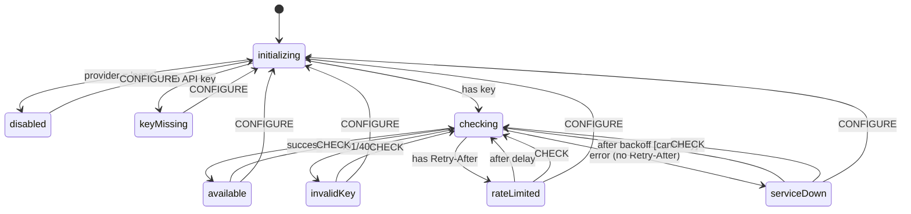

# LLM-Unavailable Flow

## Summary

Graceful degradation when the LLM is unavailable. This is the **baseline experience**—the TUI is built degraded-first, with LLM enhancement added when available.

## Key Decisions

| Aspect                | Decision                                                                 |
| --------------------- | ------------------------------------------------------------------------ |
| Provider config       | `agent.llm: 'none' \| 'anthropic'` (extensible for future providers)     |
| Startup               | Non-blocking; start in `checking`, transition when complete              |
| Invalid key (401/403) | No auto-retry; manual CHECK or CONFIGURE only                            |
| Rate limited          | Auto-retry using `Retry-After` header if present, default 60s            |
| Service down          | Auto-retry with exponential backoff: 10s initial, 10min max, 5 attempts  |
| Error classification  | Retry-After driven: header present → rate-limited, absent → service-down |
| Prioritization        | Strategy pattern with default: due date, then age                        |
| UI indicator          | Footer status line                                                       |
| Reflections           | Store with acknowledgment; process when back online                      |
| State location        | `@tender/agent` owns availability state via XState                       |

## Architecture

```
@tender/config
    ↓
@tender/agent
    ├── llm-availability-machine.ts  # XState state machine
    ├── availability-checker.ts      # API validation
    ├── prioritization.ts            # Task ranking strategies
    └── degraded-responses.ts        # Canned responses
    ↓
@tender/domain
    └── signals.ts                   # Signal recording
```

## State Machine



### States

| State         | Description                  | Auto-retry | User Actions   |
| ------------- | ---------------------------- | ---------- | -------------- |
| `disabled`    | User set `agent.llm: 'none'` | No         | Change config  |
| `checking`    | Validating API credentials   | -          | -              |
| `available`   | LLM is working               | No         | Manual check   |
| `keyMissing`  | No API key configured        | No         | Add key        |
| `invalidKey`  | API returned 401/403         | No         | Fix key, retry |
| `rateLimited` | Response has Retry-After     | Yes        | Manual retry   |
| `serviceDown` | Error without Retry-After    | Yes (≤5)   | Manual retry   |

### Events

| Event       | Description                              |
| ----------- | ---------------------------------------- |
| `CHECK`     | Manual retry request                     |
| `CONFIGURE` | Config changed (`{ provider, apiKey? }`) |

### Error Classification

Classification is **Retry-After driven**, not status-code driven:

- 401, 403 → `invalid-key` (credential issue)
- Any status with `Retry-After` header → `rate-limited` (server knows when to retry)
- Everything else (5xx, 429/529 without Retry-After, timeout, network error) → `service-down` (use exponential backoff)

This approach trusts the server's `Retry-After` hint when provided, and falls back to exponential backoff when it's not. Both 429 (user rate limit) and 529 (server overload) are handled uniformly.

## Configuration

```typescript
interface AgentConfig {
	llm: 'none' | 'anthropic' // default: 'anthropic'
	apiKey?: string // or ANTHROPIC_API_KEY env var
	maxRetries: number // default: 5
	baseBackoffMs: number // default: 10_000 (10s)
	maxBackoffMs: number // default: 600_000 (10min)
	rateLimitDefaultMs: number // default: 60_000 (60s)
}
```

## UI Mapping

| State         | Status line              | Additional UI    |
| ------------- | ------------------------ | ---------------- |
| `disabled`    | (none)                   | -                |
| `checking`    | "AI: Checking..."        | -                |
| `available`   | "AI: Online"             | -                |
| `keyMissing`  | "AI: Key required"       | Modal to add key |
| `invalidKey`  | "AI: Invalid key"        | Retry button     |
| `rateLimited` | "AI: Rate limited (42s)" | Countdown        |
| `serviceDown` | "AI: Unavailable"        | Retry button     |

## Future Enhancements

- **Status page polling**: Poll `status.claude.com/api/v2/status.json` when available to detect outages early
- **Additional providers**: `'openai'`, `'gemini'`, model-specific variants

## Out of Scope

- Actual LLM integration (Vercel AI SDK, Anthropic calls)
- TUI/CLI implementation
- Streaming responses
- Conversation history persistence
