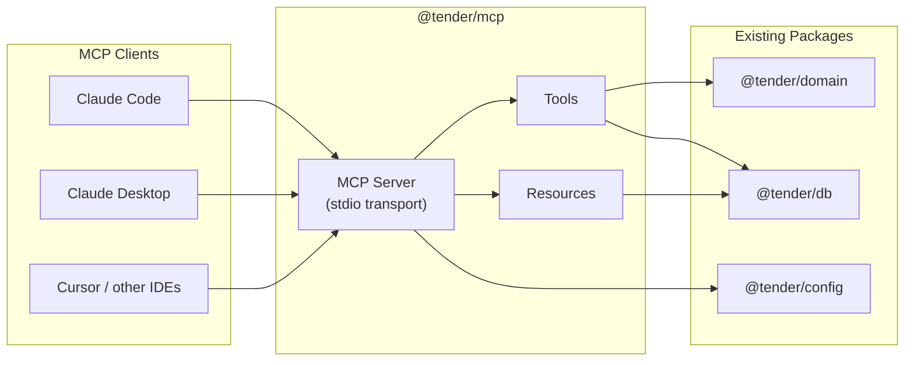

# LLM Data Access: MCP Server for Development and Beyond

## Status

Proposed

## Context

We need Claude (and potentially other LLMs) to interact with Tender's data during development and, eventually, as part of the application itself. Today the only option is raw `sqlite3` commands, which is slow, error-prone, and disconnected from Tender's domain model.

Four framings were considered:

- **(a) LLM as peer client** — alongside CLI/TUI, consuming application logic
- **(b) LLM as data-layer client** — direct DB access for maintenance and dev
- **(c) LLM as application-logic participant** — deeply integrated, with hooks into both data and domain
- **(d) Agnostic** — just improve DX into the data layer; decide the bigger picture later

### Analysis

**Option (a)** is the end-state described in ADR 0003: the Tender agent calls domain functions via tools, participates in conversations, and is a full peer to the TUI. But that agent doesn't exist yet — it needs conversation history, a system prompt, and Vercel AI SDK wiring. Building it now to solve the DX problem would be premature.

**Option (b)** solves the immediate pain. During development, we constantly need to inspect tasks, signals, and templates; seed test data; verify migrations; and debug state. A structured data-access layer for LLMs would accelerate all of this.

**Option (c)** is appealing but conflates two concerns. The in-app agent (ADR 0003) needs emotional intelligence, conversation state, and careful UX integration. The development tool needs fast, flexible data access. Coupling them prematurely would constrain both.

**Option (d)** is honest but insufficiently opinionated. We know enough to make a decision.

### Pressure Test: Recurrence Debugging

Consider: a user enters "every month on the 17th" as a due date. We want Claude to verify whether that got stored as the right recurrence logic, and if not, to help develop the fix using a feedback loop against a local Tender instance.

This reveals three gaps that a naive data-access-only MCP server can't handle:

1. **Domain logic introspection** — Claude can `SELECT recurrence FROM templates` and see raw JSON like `{"type":"rrule","rule":"FREQ=MONTHLY;BYMONTHDAY=17"}`, but can't call `Recurrence.from(...)` to verify parsing or `nextAfter("2026-02-18T00:00:00Z")` to prove it computes March 17th. Data access alone makes the LLM _guess_ correctness from serialized form instead of _verifying_ it.

2. **Throwaway databases** — Developing a recurrence feature means creating templates, spawning tasks, checking dates, iterating. That must happen against a disposable database, not the user's real data.

3. **Template management** — Tasks are only half the recurrence story. The LLM also needs to create and inspect templates with recurrence rules.

These gaps push the design beyond pure data access toward exposing domain functions as tools.

### Pressure Test: Bulk Tag Rename

Consider: a user renames project Foo to Bar and asks Claude to "find all open, soft-deleted, and closed tasks and change #foo to #bar."

This reveals two more gaps:

1. **Missing "reword" action** — `tender_manage_task` supports create/complete/delete/skip but not updating a task's description. The TUI has reword (`[w]` key), the hook has `rewordTask()`, but the MCP tool doesn't expose it. Claude literally cannot edit a task description.

2. **No batch writes** — Even with reword added, Claude would call `tender_manage_task` once per task. For 30 tasks with `#foo`, that's 30 sequential tool calls, each consuming context window. This violates "outcomes over operations" — the user's intent is ONE outcome (rename tag) but the design forces N individual operations.

3. **Dual-storage invariant** — Tags live in two places: inline in the `description` field (as `#foo`) and in the `tags` JSON array (as `["foo"]`). The domain's `rewordTask()` handles this correctly (it re-extracts tags via `extractTags()`). But if Claude tried to work around the missing reword action with raw SQL, it would need to update both columns — and `tender_query` is read-only. This is the domain layer earning its keep.

The solution follows directly from "outcomes over operations": tag rename is a single outcome, so it should be a single tool call. Tags are a first-class domain concept (dedicated parsing, dual storage, schema support on both tasks and templates), so a rename tool isn't speculative — it's a domain operation the current UI can't do.

## Decision

**Build an MCP server in `packages/mcp` that exposes Tender's data, domain operations, and domain-logic introspection to any MCP-compatible LLM client** (Claude Code, Claude Desktop, Cursor, etc.).

This is a blend of **(b)** and **(d)**: we solve the immediate DX need via a standard protocol, while building infrastructure that the future in-app agent can also consume. But the pressure test above shows we must also expose a thin slice of **(c)** — domain logic that can't be replaced by raw SQL.

### Why MCP

1. **Standard protocol** — MCP is the emerging standard for LLM-tool integration. Claude Code, Claude Desktop, Cursor, Windsurf, and others already support it. We write once, integrate everywhere.

2. **Clean separation** — The MCP server is a standalone process with its own lifecycle. It doesn't pollute the TUI, CLI, or agent packages. It can evolve independently.

3. **Incremental path to (a)** — When we're ready to build the in-app Tender agent, the MCP tools we define here become the foundation. The agent's tool definitions can wrap or directly reuse the MCP server's capabilities.

4. **Schema as documentation** — MCP tool definitions (with Zod schemas and descriptions) serve as living documentation of Tender's data model. LLMs get context about what fields mean, what values are valid, and what operations are available.

### Design Principles

These principles are drawn from emerging MCP best practices. MCP is a _user interface for AI agents_, not a REST API wrapper. What works for human developers (composability, flexibility, many options) can lead to agent confusion.

#### Outcomes over operations

Design tools around what the agent wants to accomplish, not around individual database operations. A single `tender_manage_task` tool that handles create/complete/delete/skip is better than four separate tools, because it reduces the agent's decision space and context window usage.

#### Curate ruthlessly

Keep to 5–10 tools per server. Each tool competes for context window space. Remove unused tools. Resist the urge to expose every domain function.

#### Instructions are context

Every tool description and error message influences agent behavior. Include guidance on _when_ to use a tool, not just _what_ it does. Return helpful error strings like "Task not found. Try `tender_query` with `SELECT id, description FROM tasks WHERE deleted_at IS NULL`" rather than raw exceptions.

#### Flatten arguments

Use top-level primitives and constrained types, not nested objects. Replace `filters: { status: string, tag: string }` with `status: "active" | "completed" | "deleted"` and `tag: string` as separate parameters.

#### Start read-heavy, add writes cautiously

Multiple sources recommend starting MCP servers in read-only or read-heavy mode. Our `tender_query` tool (read-only SQL) handles the most common development need. Structured write tools are added only for operations that must go through the domain layer.

#### Structured errors

Domain errors (task not found, invalid recurrence rule, FK violation) return a tool result with `{ error: string, hint: string }` — the `hint` guides the agent toward recovery (e.g., `"Task not found. Use tender_query to find valid task IDs."`). Infrastructure errors (DB unavailable, migration failure, disk full) return an MCP protocol-level error. This distinction lets agents programmatically detect and recover from expected failures.

#### Expose domain logic, not just data

Some operations can't be verified by reading raw data. Recurrence parsing, next-date computation, and signal aggregation involve domain logic that the LLM shouldn't have to reverse-engineer from serialized JSON. A small number of "domain introspection" tools make the LLM a more capable development partner.

### What to Expose

#### Resources (read-only context)

| Resource | URI               | Description                                                 |
| -------- | ----------------- | ----------------------------------------------------------- |
| Schema   | `tender://schema` | Current database schema (CREATE TABLE statements)           |
| Stats    | `tender://stats`  | Summary counts: tasks, templates, signals, completion rates |

Resources are loaded into context automatically by some clients, giving the LLM ambient awareness of the data model without tool calls.

#### Tools

Following the "outcomes over operations" principle, we consolidate into a small set of high-level tools. All tool names are prefixed with `tender_` to avoid collision when multiple MCP servers are active.

**Data tools:**

| Tool                     | Description                                                                                                                                                                                                                                                       | Mode  |
| ------------------------ | ----------------------------------------------------------------------------------------------------------------------------------------------------------------------------------------------------------------------------------------------------------------- | ----- |
| `tender_query`           | Execute read-only SQL against the database. Supports SELECT and WITH (CTEs). Timeout: 5s, row limit: 1000. Returns results as JSON. Use this for ad-hoc analysis, debugging, and any read that doesn't have a dedicated tool.                                     | Read  |
| `tender_list_tasks`      | List tasks with optional filters. Returns active tasks by default; pass `status` to include completed or deleted. Includes computed fields (overdue, deferral count) that raw SQL wouldn't have.                                                                  | Read  |
| `tender_list_templates`  | List templates with recurrence info and next-due dates.                                                                                                                                                                                                           | Read  |
| `tender_manage_task`     | Perform an action on a task. Routes through the domain layer to enforce soft-delete, signal recording, recurrence spawning, and tag re-extraction. See action table below.                                                                                        | Write |
| `tender_manage_template` | Create, update, archive, or unarchive a template with recurrence. Routes through the domain layer to validate recurrence rules and re-extract tags before storage.                                                                                                | Write |
| `tender_record_signal`   | Record a behavioral signal (deferred, completed, reflection, etc.) for a task.                                                                                                                                                                                    | Write |
| `tender_rename_tag`      | Rename a tag across all tasks and templates. Replaces `#old` with `#new` in descriptions and re-extracts the `tags` JSON column for each affected row. Returns the count and IDs of modified tasks and templates. Operates within a transaction — all or nothing. | Write |

**`tender_manage_task` actions:**

| Action       | Description                                                                                   |
| ------------ | --------------------------------------------------------------------------------------------- |
| `create`     | Create a new task with description, optional due date, and optional preparation notes.        |
| `complete`   | Set `completed_at` and record a `completed` signal.                                           |
| `uncomplete` | Clear `completed_at` and remove the `completed` signal.                                       |
| `delete`     | Soft-delete (set `deleted_at`).                                                               |
| `undelete`   | Reverse a soft-delete (clear `deleted_at`).                                                   |
| `skip`       | Record a `deferred` signal. Task remains active but is deprioritized for the current session. |
| `reword`     | Update the task description. Re-extracts tags to maintain the dual-storage invariant.         |
| `reschedule` | Change the task's `due_at` timestamp.                                                         |

**Domain introspection tools:**

| Tool               | Description                                                                                                                                                                                                                                                                                                                                                                                                                                                                                                           | Mode |
| ------------------ | --------------------------------------------------------------------------------------------------------------------------------------------------------------------------------------------------------------------------------------------------------------------------------------------------------------------------------------------------------------------------------------------------------------------------------------------------------------------------------------------------------------------- | ---- |
| `tender_date_calc` | Read-only recurrence and date computation. Wraps the domain's `Recurrence` engine so Claude can _verify_ recurrence logic, not just read stored data. Accepts an RRULE string (e.g., `FREQ=MONTHLY;BYMONTHDAY=17`) or ISO 8601 duration (e.g., `P4W`). Supports operations like: validate a rule and describe it in plain English, compute the next N occurrences after a date, find all occurrences within a date range, add a duration to a date. Exact modes and parameters will be defined during implementation. | Read |

**Infrastructure tools:**

| Tool              | Description                                                                                                                                                                                                                                                                                                                                                                                                                                  | Mode  |
| ----------------- | -------------------------------------------------------------------------------------------------------------------------------------------------------------------------------------------------------------------------------------------------------------------------------------------------------------------------------------------------------------------------------------------------------------------------------------------- | ----- |
| `tender_open_db`  | Open an additional database connection and return a handle. Accepts a file path or `:memory:`. Runs migrations on the new connection. Returns `{ handle: string }`. Pass this handle as the `db` parameter on any other tool to target that connection instead of the default. Handles are process-scoped — cleaned up when the server process exits. Does not affect the default connection or other handles. Cap: 20 simultaneous handles. | Infra |
| `tender_close_db` | Close a database connection opened by `tender_open_db` and release its handle. Returns an error if the handle is unknown.                                                                                                                                                                                                                                                                                                                    | Infra |

Ten tools — within the 5–10 range from our design principles.

**The `db` parameter.** Every tool accepts an optional `db` parameter (a handle from `tender_open_db`). Omitted = default database. This replaces global connection switching with a value-based approach:

- No global mutable state — `tender_open_db` creates an isolated connection, nothing else changes
- Multiple databases open simultaneously — one agent can query prod while another experiments on a copy
- No "switch back" ceremony — the default is always the default
- Bounded — max 20 simultaneous handles. `tender_close_db` releases a handle explicitly; remaining handles are cleaned up when the server process exits (stdio transport guarantees this).

**Why `tender_query` is the star tool.** During development, most interactions are exploratory: "show me tasks deferred more than twice," "what signals exist for this task," "are there any templates without tasks." A flexible SQL tool handles all of these without tool proliferation. The structured tools (`manage_task`, `manage_template`) exist for operations that need domain logic (invariant enforcement), not for reads that SQL handles fine.

**Why `tender_rename_tag` exists.** Tags are a first-class domain concept with dedicated parsing (`extractTags()`), dual storage (inline in `description` + `tags` JSON array), and schema support on both tasks and templates. Renaming a tag is a single user outcome — "change #foo to #bar everywhere" — but the naive approach (loop `tender_manage_task` with action=reword for each affected row) would require N tool calls, waste context, and risk partial application. A dedicated tool handles the entire operation in one transactional call, maintaining the dual-storage invariant via `extractTags()`.

This is also the litmus test for when to add a batch tool vs. leaving it to individual calls: if the operation (a) touches a domain concept with invariants that raw SQL would break, (b) the "one call per row" approach is unreasonably expensive, and (c) the operation is a recognizable user outcome (not a contrived composite), it earns a dedicated tool.

**Why `tender_date_calc` exists.** Claude can do simple date arithmetic in its head. Claude _cannot_ evaluate `FREQ=MONTHLY;BYDAY=2TU` to find "the second Tuesday in June" — that requires the `rrule` library. This tool exposes the domain's recurrence engine for verification and computation.

Consider verifying that "every month on the 17th" was stored correctly. With only `tender_query`, Claude sees `{"type":"rrule","rule":"FREQ=MONTHLY;BYMONTHDAY=17"}` and must _infer_ correctness. With `tender_date_calc`:

```
tender_date_calc({
  mode: "next",
  rule: "FREQ=MONTHLY;BYMONTHDAY=17",
  after: "2026-02-18T00:00:00Z",
  count: 3
})
→ { "isValid": true, "description": "every month on the 17th",
   "dates": ["2026-03-17T00:00:00Z", "2026-04-17T00:00:00Z", "2026-05-17T00:00:00Z"] }
```

Now Claude can _prove_ the recurrence is correct — or identify the bug if it isn't.

**Why `tender_open_db` exists (and why it returns a handle, not switching globally).** Claude cannot spin up a new MCP server at runtime. If it copies the production DB to a temp file for a dry run, it needs a way to tell the _existing_ server to open that file. The original design (`tender_use_db`) switched the server's global connection — classic shared mutable state. If a weekly-summarizer agent and an interactive Claude session share an MCP server, one's `use_db` call would hijack the other's queries.

The handle-based design avoids this: `tender_open_db` creates an isolated connection and returns a handle. The default connection is never affected. Multiple agents can open different databases simultaneously without interference. `TENDER_DB_PATH` (env var) still sets the startup default; `tender_open_db` adds connections at runtime without mutating global state.

#### Prompts (reusable prompt templates)

| Prompt          | Description                                                                          |
| --------------- | ------------------------------------------------------------------------------------ |
| `day-summary`   | Summarize today's tasks, completions, and deferrals                                  |
| `task-analysis` | Analyze a task's signal history for patterns (avoidance, productive procrastination) |

Prompts are optional and can be added incrementally.

### What Doesn't Get a Tool

Not every bulk operation needs a dedicated tool. The litmus test (from the tag rename analysis):

1. Does it involve a domain invariant that raw SQL would break?
2. Is the "one call per row" approach unreasonably expensive (>10 rows typical)?
3. Is it a recognizable user outcome, not a contrived composite?

If all three: add a tool. Otherwise, the fallback patterns are:

- **Claude Code / Cursor:** Write a one-off TypeScript script that imports `@tender/domain` and `@tender/db`, runs the operation through the domain layer, and is deleted after use. The MCP server's `tender_query` tool helps Claude understand the problem; Claude's native file/bash tools handle the solution.
- **Claude Desktop / other MCP-only clients:** Use `tender_query` to find affected rows, then loop individual `tender_manage_task` calls. Slower, but correct if going through the domain layer.

Examples of operations that do NOT earn a tool:

- "Delete all tasks older than 6 months" — `tender_manage_task` with action=delete, looped. No invariant beyond soft-delete, which the existing tool handles.
- "Bulk import tasks from a CSV" — one-off script territory. Too varied to standardize as a tool.
- "Push all due dates out by a week" — `tender_manage_task` with action=reschedule, looped. Claude can do the date math itself (add 7 days). No domain invariant at risk — due dates are plain timestamps.
- "Reschedule task X to the day after its June occurrence" — Claude uses `tender_date_calc` to find the June occurrence, does the "+1 day" arithmetic itself, then calls `tender_manage_task(action=reschedule)`. A few tool calls, but each is simple and Claude controls the logic. No dedicated "smart reschedule" tool needed.

### Worked Examples

These show how existing tools compose to handle real scenarios without new tools.

#### "How many tasks have I completed this week?"

```
tender_query({ sql: "SELECT count(*) as n FROM tasks WHERE completed_at >= date('now', '-7 days')" })
→ { "rows": [{ "n": 12 }] }
```

One call. Pure SQL.

#### "Which tasks keep getting deferred?"

```
tender_query({
  sql: "SELECT t.id, t.description, count(*) as deferrals FROM tasks t JOIN signals s ON s.task_id = t.id WHERE s.kind = 'deferred' AND t.deleted_at IS NULL GROUP BY t.id HAVING count(*) >= 3 ORDER BY deferrals DESC"
})
```

One call. Joins tasks to signals — exactly the kind of ad-hoc analysis `tender_query` was designed for.

#### "Dry-run a tag rename before committing"

```bash
# Claude does this via Bash (sqlite3 .backup is WAL-safe, unlike plain cp):
sqlite3 ~/.local/share/tender/tender.db ".backup /tmp/tender-dry-run.db"
```

```
tender_open_db({ path: "/tmp/tender-dry-run.db" })
→ { "handle": "dry" }

tender_query({ sql: "SELECT id, description FROM tasks WHERE description LIKE '%#foo%'", db: "dry" })
→ 14 rows

tender_rename_tag({ from: "foo", to: "bar", db: "dry" })
→ { "tasks_modified": 14, "templates_modified": 2 }

tender_query({ sql: "SELECT id, description FROM tasks WHERE description LIKE '%#bar%'", db: "dry" })
→ verify results look right

# Satisfied — now apply to real DB (no handle = default):
tender_rename_tag({ from: "foo", to: "bar" })
```

No global state flip-flopping. The dry-run handle and the default DB coexist without interference.

#### "Set up a realistic test database for QA"

```
tender_open_db({ path: ":memory:" })
→ { "handle": "qa" }

tender_manage_template({ action: "create", description: "Water plants #home", recurrence: "P2W", db: "qa" })
tender_manage_template({ action: "create", description: "Review finances #admin", recurrence: "FREQ=MONTHLY;BYMONTHDAY=1", db: "qa" })

tender_manage_task({ action: "create", description: "Call dentist #health", db: "qa" })
tender_manage_task({ action: "create", description: "Write blog post #work #writing", due_at: "2026-02-20T23:59:59Z", db: "qa" })
tender_manage_task({ action: "create", description: "Fix login bug #work #dev", db: "qa" })

# Simulate some history
tender_manage_task({ action: "complete", id: "...", db: "qa" })
tender_record_signal({ task_id: "...", kind: "deferred", db: "qa" })
tender_record_signal({ task_id: "...", kind: "reflection", payload: { text: "felt good" }, db: "qa" })
```

#### "Verify a recurrence rule computes correctly for a specific month"

```
tender_date_calc({
  mode: "between",
  rule: "FREQ=MONTHLY;BYDAY=2TU",
  from: "2026-06-01T00:00:00Z",
  to: "2026-06-30T23:59:59Z"
})
→ { "dates": ["2026-06-09T00:00:00Z"] }  # second Tuesday of June
```

Claude couldn't do this without the rrule library. This is why `tender_date_calc` exists.

### Architecture

```
packages/mcp/
├── src/
│   ├── index.ts          # MCP server setup, DB init, stdio transport
│   ├── resources.ts      # Schema and stats resources
│   ├── tools/
│   │   ├── query.ts      # tender_query (read-only SQL)
│   │   ├── tasks.ts      # tender_list_tasks + tender_manage_task
│   │   ├── templates.ts  # tender_list_templates + tender_manage_template
│   │   ├── tags.ts       # tender_rename_tag
│   │   ├── signals.ts    # tender_record_signal
│   │   ├── recurrence.ts # tender_date_calc (domain introspection)
│   │   └── db.ts         # tender_open_db + tender_close_db (infrastructure)
│   └── prompts.ts        # day-summary, task-analysis
├── package.json
└── tsconfig.json
```



### Dependency Rules

- `@tender/mcp` depends on `@tender/domain`, `@tender/db`, and `@tender/config`
- `@tender/mcp` does NOT depend on `@tender/tui`, `@tender/agent`, or `@tender/cli`
- Write tools go through `@tender/domain` to enforce invariants (soft-delete, signals, recurrence)
- Read tools may use domain functions or the readonly SQL tool
- The MCP server resolves the DB path via `@tender/config` (XDG paths), same as CLI

### Transport

Stdio transport (the MCP default for local tools). The server runs as a subprocess of the MCP client. No HTTP, no auth — it's a local development tool accessing a local SQLite file.

### Observability

With stdio transport, stdout is the MCP protocol wire — any stray `console.log` corrupts the JSON-RPC stream. The server must log diagnostic information to stderr or to a file at the path returned by `getDebugLogPath()` (already in `@tender/config`), never to stdout.

At minimum, log:

- **Startup:** resolved DB path and migration result
- **Each tool invocation:** tool name, `db` handle (if any), and wall-clock duration
- **Errors:** full stack trace with the tool name and arguments that triggered it

### Database Targeting

The MCP server must support pointing at different databases at two levels:

**Startup default** — the `TENDER_DB_PATH` environment variable (shared with `@tender/config`):

| Value              | Behavior                                                                            |
| ------------------ | ----------------------------------------------------------------------------------- |
| _(unset)_          | Default XDG path (`~/.local/share/tender/tender.db`) via `@tender/config`           |
| `/path/to/test.db` | Explicit file path (for test fixtures, QA databases)                                |
| `:memory:`         | In-memory database. Migrations run on startup. Empty — use write tools to populate. |

**Runtime connections** — the `tender_open_db` tool. Claude can't spin up a new MCP server mid-conversation, so the server must support opening additional connections. Unlike the original `tender_use_db` design (which switched a global connection), `tender_open_db` returns a handle — a value, not a side effect. This enables concurrent access:

```
# Agent A (interactive): queries prod, no handle needed
tender_query({ sql: "SELECT ..." })

# Agent B (weekly summarizer): opens its own connection
tender_open_db({ path: ":memory:" })  → { handle: "abc" }
tender_manage_task({ action: "create", ..., db: "abc" })
tender_query({ sql: "SELECT ...", db: "abc" })
```

No contention. Agent A's queries always hit the default DB. Agent B's queries always hit its handle. Neither affects the other.

The **snapshot-experiment-discard** workflow:

1. Claude snapshots the production DB to a temp file (Bash: `sqlite3 ~/.local/share/tender/tender.db ".backup /tmp/tender-dry-run.db"` — WAL-safe, unlike plain `cp`)
2. Claude calls `tender_open_db({ path: "/tmp/tender-dry-run.db" })` → `{ handle: "dry" }`
3. Claude experiments against the handle: `tender_rename_tag({ from: "foo", to: "bar", db: "dry" })`
4. Claude verifies: `tender_query({ sql: "SELECT ...", db: "dry" })`
5. If satisfied, runs the same operation without a handle (hits real DB)
6. If not, the temp file is discarded — no harm done, default DB untouched

Handles are process-scoped: cleaned up when the server process exits. With stdio transport, the server dies when the client disconnects, so leaked handles can't accumulate across sessions. `tender_close_db` provides explicit cleanup within a session. The server enforces a cap of 20 simultaneous handles — enough for any reasonable workflow, small enough to prevent runaway memory growth from a looping agent.

### Configuration

Add the MCP server to `.claude/settings.json` (or equivalent) for each client:

```jsonc
// .claude/settings.json (project-level)
{
	"mcpServers": {
		"tender": {
			"command": "npx",
			"args": ["tsx", "packages/mcp/src/index.ts"],
		},
	},
}
```

No build step — consistent with the rest of the monorepo. A single server entry is sufficient: the default DB comes from `TENDER_DB_PATH` (or XDG default), and agents use `tender_open_db` at runtime when they need additional connections.

## Consequences

### Positive

- **Immediate DX improvement** — Claude Code can inspect and manipulate Tender data through structured tools instead of raw SQL
- **Living documentation** — Tool schemas document the data model for any LLM
- **Reusable foundation** — When we build the in-app agent (ADR 0003), these tools are ready
- **Standard protocol** — Works with any MCP client, not just Claude
- **Testable in isolation** — MCP tools are pure functions over domain/db; easy to unit test

### Negative

- **New package to maintain** — Another entry in the monorepo
- **Potential drift** — MCP tools and domain layer could diverge if not kept in sync
- **Not the agent** — This doesn't give us the emotional intelligence / conversation features of ADR 0003; it's infrastructure
- **Domain introspection scope creep** — `tender_date_calc` opens the door to exposing every domain function. Must resist: add introspection tools only when raw data inspection is genuinely insufficient.

### Risks

| Risk                                               | Mitigation                                                                                                                                                                                             |
| -------------------------------------------------- | ------------------------------------------------------------------------------------------------------------------------------------------------------------------------------------------------------ |
| MCP protocol instability                           | Pin `@modelcontextprotocol/sdk` version; protocol is stabilizing rapidly                                                                                                                               |
| Tool proliferation                                 | Cap at 10 tools; prefer `tender_query` over new read tools                                                                                                                                             |
| Write operations bypass domain logic               | Write tools must call domain functions, never raw SQL. Enforce via code review + tests                                                                                                                 |
| Confusion with future agent tools                  | Clear naming: `@tender/mcp` is the dev tool server; `@tender/agent` is the in-app agent                                                                                                                |
| Context window waste                               | Keep tool descriptions concise; use resources for ambient schema context                                                                                                                               |
| In-memory DB diverges from real DB                 | Both paths run the same migrations. Integration tests should cover both.                                                                                                                               |
| Domain introspection becomes a second domain layer | Introspection tools must be thin wrappers around existing domain functions, not new logic. If the function doesn't exist in `@tender/domain`, it doesn't get a tool — build the domain function first. |

## Relationship to Other ADRs

- **ADR 0003 (Agent Architecture)** — MCP provides the tool layer that the in-app agent will eventually consume. The agent adds conversation, personality, and emotional intelligence on top.
- **ADR 0005 (Readonly SQL Spike)** — The `tender_query` tool directly implements the readonly client pattern from this spike.
- **ADR 0006 (LLM Unavailable Plan)** — MCP server availability is independent of in-app LLM availability. The MCP server is a dev tool; unavailability just means the dev can't use Claude for data access.

## Research Sources

- [MCP Architecture Overview](https://modelcontextprotocol.io/docs/learn/architecture)
- [Less is More: 4 Design Patterns for Building Better MCP Servers](https://www.klavis.ai/blog/less-is-more-mcp-design-patterns-for-ai-agents) — semantic search, workflow-based, code mode, progressive discovery
- [MCP is Not the Problem, It's Your Server: Best Practices](https://www.philschmid.de/mcp-best-practices) — outcomes over operations, flatten arguments, curate ruthlessly
- [MCP Server Best Practices for 2026](https://www.cdata.com/blog/mcp-server-best-practices-2026)
- [MCP Best Practices: Architecture & Implementation Guide](https://modelcontextprotocol.info/docs/best-practices/)
- [Building Scalable MCP Servers with Domain-Driven Design](https://medium.com/@chris.p.hughes10/building-scalable-mcp-servers-with-domain-driven-design-fb9454d4c726)
- [@modelcontextprotocol/sdk TypeScript documentation](https://github.com/modelcontextprotocol/typescript-sdk)
