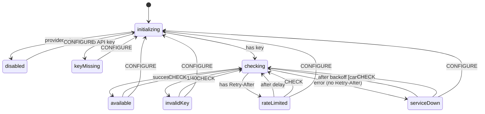

# @tender/agent

LLM agent scaffolding with availability state machine and prioritization strategies.

## Overview

This package provides the infrastructure for managing LLM availability with graceful degradation. It's designed with a "degraded-first" philosophy—the app works without the LLM, and LLM features enhance the experience when available.

## LLM Availability State Machine

The availability state machine handles different failure modes with appropriate retry strategies:



### States

| State         | Description                  | Auto-retry    | User Actions   |
| ------------- | ---------------------------- | ------------- | -------------- |
| `disabled`    | User set `agent.llm: 'none'` | No            | Change config  |
| `checking`    | Validating API credentials   | -             | -              |
| `available`   | LLM is working               | No            | Manual check   |
| `keyMissing`  | No API key configured        | No            | Add key        |
| `invalidKey`  | API returned 401/403         | No            | Fix key, retry |
| `rateLimited` | Response has `Retry-After`   | Yes           | Manual retry   |
| `serviceDown` | Error without `Retry-After`  | Yes (limited) | Manual retry   |

### Error Classification

Classification is **Retry-After driven**, not status-code driven:

- **401, 403** → `invalidKey` (credential issue, no auto-retry)
- **Any status with `Retry-After` header** → `rateLimited` (server knows when to retry)
- **Everything else** (5xx, 429/529 without `Retry-After`, timeout) → `serviceDown` (exponential backoff)

This approach trusts the server's retry hint when provided. Both 429 (user rate limit) and 529 (server overload) are handled uniformly based on whether they include a `Retry-After` header.

### Retry Strategies

- **Rate Limited**: Uses `Retry-After` header value, defaults to 60 seconds if not provided
- **Service Down**: Exponential backoff starting at 10 seconds, max 10 minutes, up to 5 retries

### Configuration

```typescript
interface LlmAvailabilityInput {
	provider: 'none' | 'anthropic'
	apiKey: string | undefined
	maxRetries?: number // default: 5
	baseBackoffMs?: number // default: 10,000 (10s)
	maxBackoffMs?: number // default: 600,000 (10min)
	rateLimitDefaultMs?: number // default: 60,000 (60s)
}
```

## Prioritization Strategies

When the LLM is unavailable, tasks are prioritized using configurable strategies:

- **`dueDateAgeStrategy`** (default): Tasks with due dates first (sorted by due date), then by age (oldest first)
- **`ageOnlyStrategy`**: Oldest tasks first
- **`dueDateOnlyStrategy`**: Only considers due dates

## Degraded Mode Responses

Canned responses for common interactions when offline:

```typescript
import { degradedResponses, formatResponse } from '@tender/agent'

// Static responses
degradedResponses.reflectionRecorded
// => "Recorded. I'll dig into this when I'm back online..."

// Templated responses
formatResponse('taskCompletedWithName', { taskName: 'Email grandma' })
// => "Nice work on 'Email grandma'!"
```

## Usage

```typescript
import { createActor } from 'xstate'
import { llmAvailabilityMachine } from '@tender/agent'

const actor = createActor(llmAvailabilityMachine, {
	input: {
		provider: 'anthropic',
		apiKey: process.env.ANTHROPIC_API_KEY,
	},
})

actor.subscribe((state) => {
	console.log('State:', state.value)
	console.log('Context:', state.context)
})

actor.start()

// Manual retry
actor.send({ type: 'CHECK' })

// Reconfigure at runtime
actor.send({ type: 'CONFIGURE', provider: 'none' })
```
